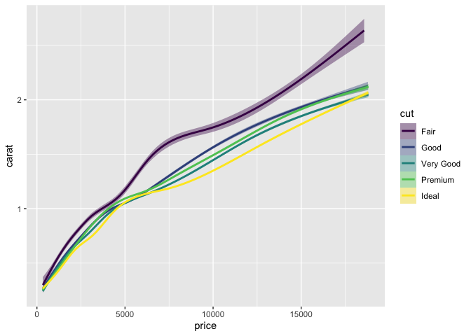

Super Linter Testing
================
**Repo Manager:** Adam Shelton <br />
**Last updated:** July 09, 2021

## Overview

This repo is for testing purposes only!

``` r
library(tidyverse)
```

    ## ── Attaching packages ─────────────────────────────────────── tidyverse 1.3.1 ──

    ## ✓ ggplot2 3.3.5     ✓ purrr   0.3.4
    ## ✓ tibble  3.1.2     ✓ dplyr   1.0.7
    ## ✓ tidyr   1.1.3     ✓ stringr 1.4.0
    ## ✓ readr   1.4.0     ✓ forcats 0.5.1

    ## ── Conflicts ────────────────────────────────────────── tidyverse_conflicts() ──
    ## x dplyr::filter() masks stats::filter()
    ## x dplyr::lag()    masks stats::lag()

``` r
library(knitr)

diamonds %>% ggplot(aes(x = price, y = carat, color = cut, fill = cut)) + geom_smooth()
```

    ## `geom_smooth()` using method = 'gam' and formula 'y ~ s(x, bs = "cs")'

<!-- -->

``` r
quantile(diamonds$price) %>% enframe() %>% kable()
```

| name |    value |
|:-----|---------:|
| 0%   |   326.00 |
| 25%  |   950.00 |
| 50%  |  2401.00 |
| 75%  |  5324.25 |
| 100% | 18823.00 |

``` r
diamonds %>% count(color) %>% kable()
```

| color |     n |
|:------|------:|
| D     |  6775 |
| E     |  9797 |
| F     |  9542 |
| G     | 11292 |
| H     |  8304 |
| I     |  5422 |
| J     |  2808 |
